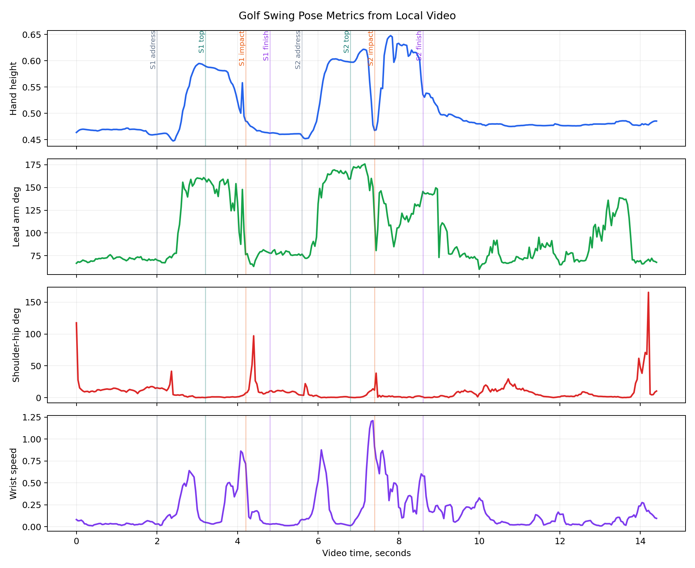
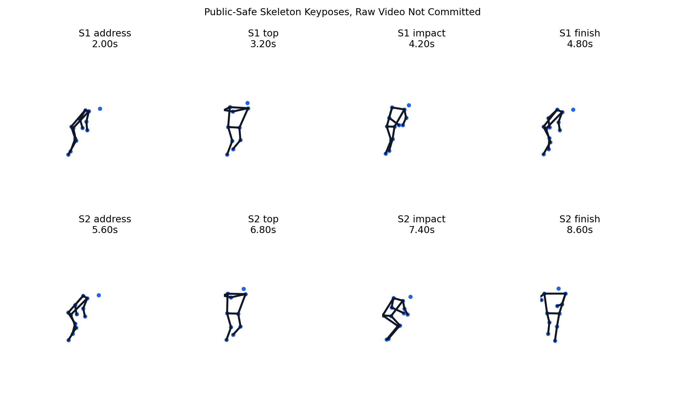

# SwingForm AI

[中文说明](./README.zh-CN.md)

SwingForm AI is a research-style toolkit for AI-assisted golf swing analysis, with a shared posture-control core that can later support basketball shooting form.

The first release focuses on one practical loop:

```text
phone video -> pose landmarks -> movement phase -> biomechanical metrics -> coaching cue
```

The project starts with golf because a golf swing has well-defined events and repeatable practice footage. The same architecture keeps sport-specific rules separate, so basketball can add shot phases, release metrics, and follow-through checks without rewriting the pose pipeline.

## Current Repository Map

| Path | Use |
| --- | --- |
| `docs/research_scan_2026-05-31.md` | Current research and product scan for golf and basketball posture analysis |
| `docs/requirements.md` | Product requirements, MVP scope, and evaluation targets |
| `docs/architecture.md` | Modular pipeline for video, pose, phase detection, metrics, and feedback |
| `docs/data_governance.md` | Privacy boundary for personal videos, public datasets, and derived metrics |
| `docs/personal_data_program.md` | Long-term plan for private practice data, labels, metrics, and reports |
| `src/swingform_ai/` | Lightweight Python package for pose schemas, geometry, and sport profiles |
| `scripts/register_local_session.py` | Local-only session manifest tool for personal practice videos |
| `scripts/analyze_local_golf_video.py` | Local golf video analyzer with public-safe demo export |
| `examples/` | Small synthetic examples that are safe to commit |
| `tests/` | Unit tests for geometry and sport metric helpers |
| `data/` | Data policy and local-only data folders |

## Start Here

1. Read the research scan in [docs/research_scan_2026-05-31.md](docs/research_scan_2026-05-31.md).
2. Review the requirements in [docs/requirements.md](docs/requirements.md).
3. Install the package in editable mode:

```bash
python -m pip install -e .
```

4. Run the tiny pose-metric demo:

```bash
python -m swingform_ai.analyze_pose_json examples/sample_pose_sequence.json --sport golf
python -m swingform_ai.analyze_pose_json examples/sample_pose_sequence.json --sport basketball
```

5. Register a private local practice video without committing it:

```bash
python scripts/register_local_session.py /path/to/golf.mp4 --sport golf
```

## MVP Definition

The first milestone is not a polished mobile app. It is a reproducible analysis notebook and command-line workflow that can:

1. Accept a single-person golf swing video or exported pose JSON.
2. Estimate body landmarks with a pluggable backend such as MediaPipe, YOLO pose, or MMPose.
3. Segment a swing into coarse events such as address, top, impact, and finish.
4. Compute interpretable metrics such as elbow angle, knee flexion, shoulder-hip separation, tempo, and balance proxies.
5. Generate a short feedback report with timestamps, annotated frames, and drill ideas.

Basketball is planned as the second sport profile:

1. Detect set, dip, lift, release, follow-through, and landing phases.
2. Track shooting-side elbow, wrist, hip, knee, ankle, balance, release height, and release timing.
3. Compare a player against their own best session before comparing against generic pro templates.

## Technical Direction

The repo separates general movement analysis from sport knowledge:

```text
video_io        -> frame sampling and metadata
pose_backends   -> MediaPipe, YOLO pose, MMPose, or exported keypoints
phase_models    -> golf swing events or basketball shot phases
metrics         -> angles, stability, tempo, and symmetry
feedback        -> rules, reports, and future LLM-assisted explanations
```

This keeps the first version small while leaving room for future 3D reconstruction, ball tracking, club tracking, and real-time practice feedback.

## Data Boundary

Personal practice videos are local-only by default. Commit only code, documentation, synthetic examples, de-identified aggregate metrics, and small approved screenshots. Raw videos, faces, exact timestamps from private sessions, commercial app exports, and downloaded model weights stay outside git unless they are explicitly cleared.

See [docs/data_governance.md](docs/data_governance.md) for the full boundary.
See [docs/personal_data_program.md](docs/personal_data_program.md) for the long-term personal data plan.

## First Local Demo

The first private golf sample was analyzed as a public-safe derived example. The raw video stays local, while pose-derived metrics and skeleton views are committed for transparency.





| Signal | Value |
| --- | ---: |
| Video length | 14.44s |
| Resolution | 320x568 |
| Pose coverage | 361 / 361 frames |
| Detected swing cycles | 2 |
| Mean landmark visibility | 0.805 |

The checked clip contains one slower practice motion and one fuller swing. Event labels are human-checked in this first example, and `impact` is an impact or low-point proxy until club and ball tracking are added.

See [docs/examples/golf_swing_demo_2026-05-31.md](docs/examples/golf_swing_demo_2026-05-31.md) and [examples/golf_swing_demo_summary.json](examples/golf_swing_demo_summary.json) for the full derived report.

## Roadmap

See [docs/roadmap.md](docs/roadmap.md) for the milestone plan.

## Development

Install in editable mode:

```bash
python -m pip install -e .
```

Run tests:

```bash
python -m unittest discover -s tests
```

## Status

Created on 2026-05-31 as a passion-driven research project around golf, basketball, AI posture analysis, and personal practice feedback.
