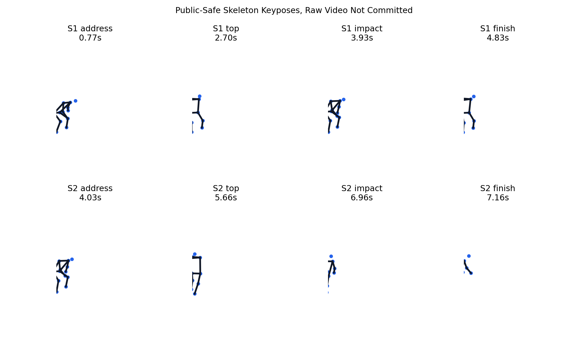
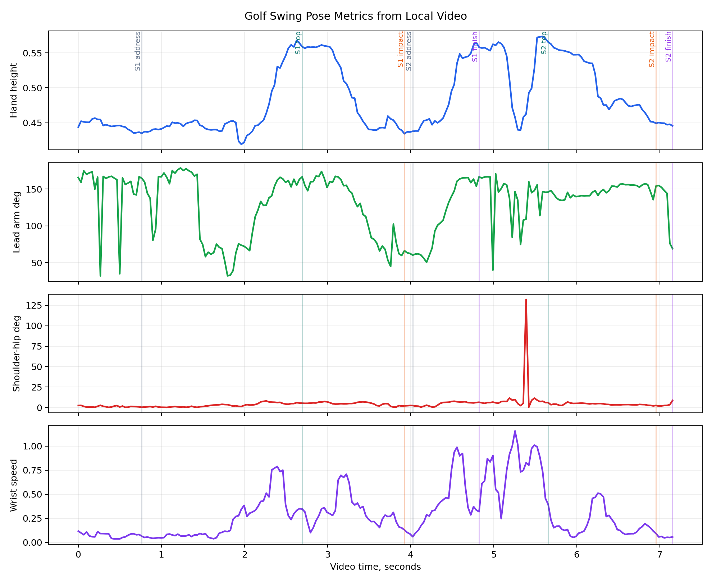

# SwingForm AI

<p align="center">
  <a href="https://github.com/rayford295/swingform-ai/actions/workflows/test.yml"></a>
  <a href="./LICENSE"></a>
  
  
  <a href="https://rayford295.github.io/swingform-ai/"></a>
  <a href="https://rayford295.github.io/swingform-ai/viewer/pose3d.html"></a>
</p>

Open-source sports-AI toolkit that turns real practice video into pose landmarks, swing phases, and explainable posture metrics. Golf is the first sport profile; basketball is built into the architecture as the next.

```
video → pose landmarks → swing phases → biomechanical metrics → feedback
```

## Demo

[](https://rayford295.github.io/swingform-ai/)

*Click the image to open the live website — includes the skeleton + ball-trail overlay video and interactive 3D pose viewer.*



*Per-frame metrics across the session: hand height · lead arm angle · shoulder-hip separation · wrist speed*

## Quickstart

```bash
# Install core (no heavy dependencies)
pip install -e .

# Install video analysis extras
pip install -e ".[pose]"

# One command: pose extraction + swing detection + ball trail + effects video
python scripts/golf_render.py your_video.mp4 --output effects.mp4

# Full analysis: metrics CSV, JSON summary, skeleton chart, timeline chart
python scripts/analyze_local_golf_video.py your_video.mp4 \
  --session-id my-session --handedness right
```

Run tests:

```bash
python -m unittest discover -s tests
```

## What It Measures

| Layer | Capability |
| --- | --- |
| Video QA | Duration, FPS, resolution, frame coverage |
| Pose | MediaPipe Pose Landmarker — 33 landmarks, image + world (3D metric) coordinates |
| Golf phases | Address, top, impact proxy, finish — auto-detected from wrist path |
| Metrics | Elbow angle, knee angle, hand height, wrist speed, shoulder-hip separation, head and hip drift |
| Ball tracking | Optical flow + body-exclusion mask + RANSAC parabolic fit |
| Output | Effects video, CSV metrics, JSON summary, 3D viewer, Markdown report |

Current limits: no club-head speed, ball speed, spin, launch angle, or carry distance. See [docs/technical_tracks.md](docs/technical_tracks.md) for the ball trajectory and 3D motion roadmap.

## Open Examples

Two sessions are fully committed — source clip, pose export, per-frame metrics, and visual output.

| Session | Video | Frames | Swings | Report |
| --- | --- | --- | --- | --- |
| [golf-swing-demo](examples/golf-swing-demo/) | 14.4s · 320×568 | 361 / 361 | 2 | [report](docs/examples/golf_swing_demo_2026-05-31.md) |
| [yifan-golf-0520](examples/yifan-golf-0520/) | 7.2s · 320×568 | 216 / 216 | 2 | [report](docs/examples/yifan-golf-0520.md) |

## Project Map

```
scripts/
  golf_render.py              ← one-command pipeline: video → effects video
  analyze_local_golf_video.py ← full analysis with charts and reports
  build_highlight_reel.py     ← score and clip best swings from long videos

src/swingform_ai/
  schema.py                   ← Landmark, FramePose, PoseSequence dataclasses
  geometry.py                 ← angle, distance, midpoint helpers
  profiles/golf.py            ← golf swing metrics and phase detection
  profiles/basketball.py      ← basketball shot metrics

docs/
  index.html                  ← project website (GitHub Pages)
  viewer/pose3d.html          ← interactive 3D skeleton viewer
  technical_tracks.md         ← ball trajectory and 3D motion roadmap
  architecture.md             ← pipeline architecture

examples/
  golf-swing-demo/            ← original open demo session
  yifan-golf-0520/            ← personal session with effects video
```

## Contributing

Contributions should improve usefulness, reproducibility, or sport coverage. See [CONTRIBUTING.md](CONTRIBUTING.md).

---

[Website](https://rayford295.github.io/swingform-ai/) · [3D Viewer](https://rayford295.github.io/swingform-ai/viewer/pose3d.html) · [中文说明](README.zh-CN.md) · MIT License
