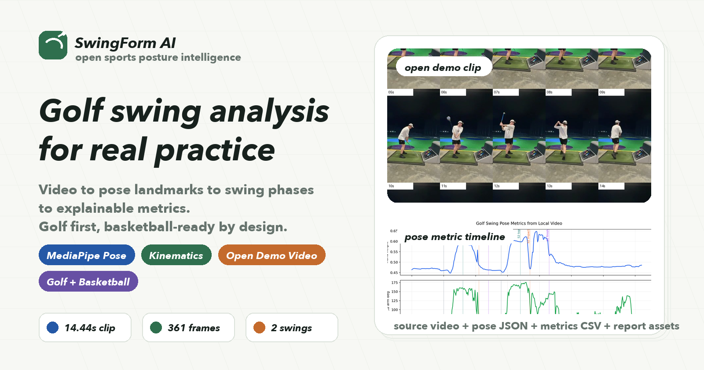
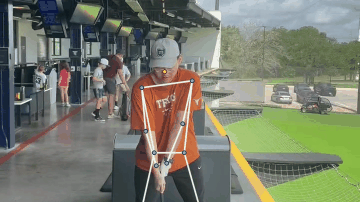
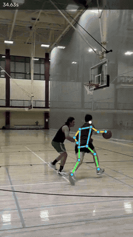

# SwingForm AI

<p align="center">
  <a href="https://github.com/rayford295/swingform-ai/actions/workflows/test.yml"></a>
  
  <a href="./LICENSE"></a>
  <a href="https://rayford295.github.io/swingform-ai/"></a>
  <a href="https://rayford295.github.io/swingform-ai/viewer/pose3d.html"></a>
</p>

<p align="center">
  <b>开源运动姿态智能分析。</b><br>
  一条命令，把手机视频变成姿态关键点、动作阶段、运动指标和骨架叠加视频。
</p>

---

<p align="center">
  
</p>

---

<table>
<tr>
<td width="50%">



<p align="center"><sub>⛳ <b>高尔夫 · TopGolf</b> · 骨架叠加 · 球轨迹 · <a href="https://github.com/rayford295/swingform-ai/blob/main/examples/yifan-golf-0601/golf.mp4">原始视频 ↗</a></sub></p>

</td>
<td width="50%">



<p align="center"><sub>🏀 <b>篮球 · 1v1 实战</b> · 骨架叠加 · 对抗中出手检测 · <a href="https://github.com/rayford295/swingform-ai/blob/main/examples/yifan-basketball-0710/basketball_overlay.mp4">完整视频 ↗</a> · <a href="https://www.youtube.com/shorts/9nPEMg---YA">YouTube Short ↗</a></sub></p>

</td>
</tr>
</table>

<p align="center"><sub><a href="https://rayford295.github.io/swingform-ai/">打开网站</a>查看完整特效视频和可交互 3D 骨架查看器</sub></p>

---

## 安装

```bash
pip install -e ".[pose]"
```

## 使用

```bash
# 骨架 + 球轨迹特效视频（一条命令完成全流水线）
python scripts/golf_render.py your_video.mp4 --output effects.mp4

# 完整分析：CSV 指标、JSON 摘要、骨架图、时间线图
python scripts/analyze_local_golf_video.py your_video.mp4 --session-id s1 --handedness right
python scripts/analyze_local_basketball_video.py your_video.mp4 --session-id s1 --shooting-side right

# 对比同一运动的两个已分析会话
python scripts/compare_sessions.py examples/yifan-golf-0520 examples/yifan-golf-0601

# 从已提交的 summary 重新生成 README 示例表格
python scripts/generate_examples_table.py

# 运行测试
python -m unittest discover -s tests
```

## 能力范围

| | 高尔夫 | 篮球 |
|---|---|---|
| **动作阶段** | 站位 · 顶部 · 击球 · 收杆 | 准备 · 下蹲 · 起跳 · 出手 · 跟进 |
| **关节角度** | 前臂角 · 后肘角 · 膝关节 | 投篮肘角 · 膝关节 |
| **空间指标** | 手部高度 · 站距 · 肩髋分离角 | 手腕高度 · 辅助手距离 |
| **时间指标** | 上杆/下杆时间 · 节奏比 | — |
| **稳定性** | 头部偏移 · 髋部偏移 | — |

球轨迹追踪使用光流 + 身体遮罩排除 + RANSAC 抛物线拟合，是**可视化辅助工具**，不测量杆头速度、球速、旋转或发射角。

## 开源示例

<!-- examples-table:start -->
| 会话 | 运动 | 视频 | 帧数 | 事件 |
|---|---|---|---|---|
| [yifan-basketball-0710](examples/yifan-basketball-0710/) | 🏀 篮球 · 1v1 | 57.1 s · 480×854 | 1621 / 1712 | 2 次出手 |
| [yifan-golf-0601](examples/yifan-golf-0601/) | ⛳ 高尔夫 | 27.0 s · 720×1280 | 802 / 809 | 3 次挥杆 |
| [yifan-golf-0520](examples/yifan-golf-0520/) | ⛳ 高尔夫 | 7.2 s · 320×568 | 216 / 216 | 2 次挥杆 |
| [golf-swing-demo](examples/golf-swing-demo/) | ⛳ 高尔夫 | 14.4 s · 320×568 | 361 / 361 | 2 次挥杆 |
<!-- examples-table:end -->

每个会话包含：原始视频 · 姿态 JSON · 指标 CSV · 可视化图表 · Markdown 报告。
跨会话对比示例：[yifan-golf-0520 vs yifan-golf-0601](docs/examples/compare-yifan-golf-0520-vs-yifan-golf-0601.md)，可用 `python scripts/compare_sessions.py examples/<a> examples/<b>` 生成自己的对比报告。

## 目录结构

```
src/swingform_ai/       核心库（数据模型、几何、运动 profile、球追踪）
scripts/                可执行流水线（golf_render、analyze、highlight_reel）
examples/               开源会话，含原始视频和所有派生产物
docs/                   网站、3D 查看器、架构文档、路线图
tests/                  单元测试（几何、profile、球追踪）
```

## 参与贡献

详见 [CONTRIBUTING.md](CONTRIBUTING.md)。欢迎提升可复现性、增加运动覆盖范围或改善可视化输出的贡献。

---

<p align="center">
  <a href="https://rayford295.github.io/swingform-ai/">网站</a> ·
  <a href="https://rayford295.github.io/swingform-ai/viewer/pose3d.html">3D 查看器</a> ·
  <a href="README.md">English</a> ·
  <a href="docs/technical_tracks.md">技术路线</a> ·
  MIT License
</p>
