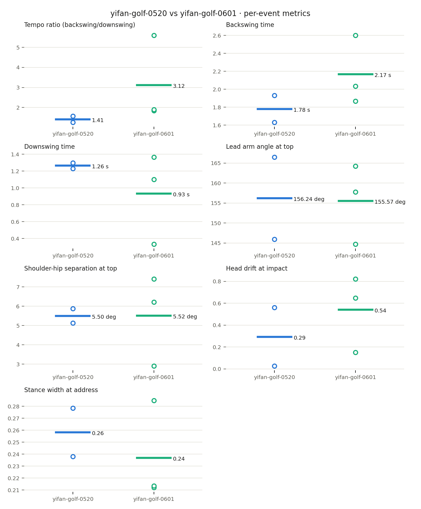

# Session Comparison: yifan-golf-0520 vs yifan-golf-0601

Same athlete, same sport (golf), two sessions. Values are per-swing means; open dots on the chart are individual events.

| Metric | yifan-golf-0520 | yifan-golf-0601 | Delta |
| --- | ---: | ---: | ---: |
| Tempo ratio (backswing/downswing) | 1.41 | 3.12 | +1.70 |
| Backswing time | 1.78 s | 2.17 s | +0.39 s |
| Downswing time | 1.26 s | 0.93 s | -0.33 s |
| Lead arm angle at top | 156.24 deg | 155.57 deg | -0.67 deg |
| Shoulder-hip separation at top | 5.50 deg | 5.52 deg | +0.01 deg |
| Head drift at impact | 0.29 | 0.54 | +0.25 |
| Stance width at address | 0.26 | 0.24 | -0.02 |

## Sessions

| | yifan-golf-0520 | yifan-golf-0601 |
| --- | --- | --- |
| Events | 2 | 3 |
| Duration | 7.2s | 27.0s |
| Resolution | 320x568 | 720x1280 |
| Pose coverage | 100.0% | 99.1% |

## Limitations

- Single-camera pose proxies; camera angle and distance differ between sessions, so cross-session deltas are directional, not calibrated measurements.
- Metrics compare only events the detector isolated in both sessions.
