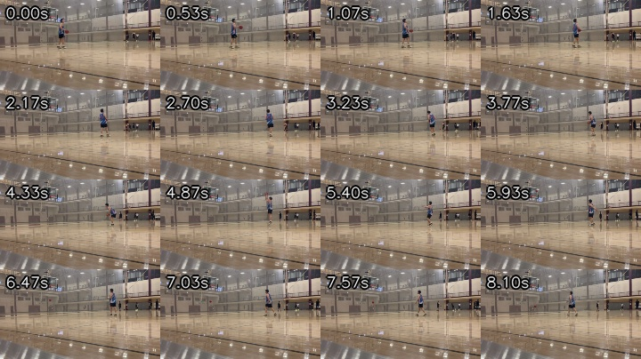
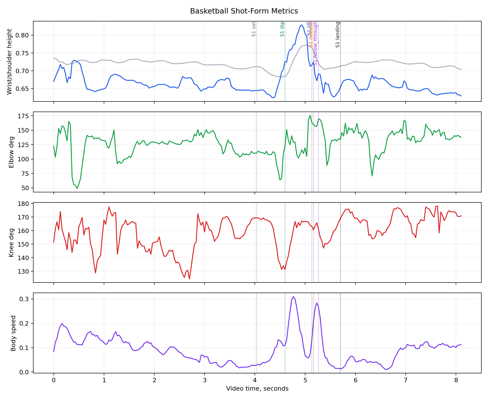
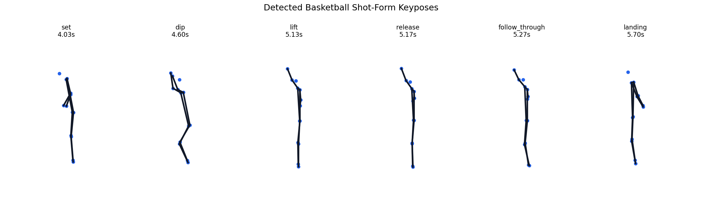

# Yifan Basketball 06.01

This demo adds basketball to the same personal motion-record format used for the golf examples.
It is useful as a body-motion and release-proxy baseline, not yet as a ball-flight or make/miss analysis.

## Open Example Files

| File | Use |
| --- | --- |
| `examples/yifan-basketball-0601/basketball.mp4` | Source basketball court clip |
| `examples/yifan-basketball-0601/basketball_overlay.mp4` | Skeleton overlay review video |
| `examples/yifan-basketball-0601/pose_sequence.json` | MediaPipe pose landmarks for tracked frames |
| `examples/yifan-basketball-0601/metrics.csv` | Per-frame basketball motion metrics |
| `examples/yifan-basketball-0601/summary.json` | Demo summary for reports |

## Video and Detection

- Duration: 8.13s
- Resolution: 568x320
- FPS: 30.01
- Pose coverage: 244 of 244 frames (100.0%)
- Mean landmark visibility: 0.807
- Reliable shot-form events isolated: 1

## Main Read

- Golf and basketball should stay as separate sport profiles inside the same repository.
- This clip proves the basketball profile can export the same core artifacts: video, pose JSON, metrics CSV, charts, and a report.
- This simpler clip tracks one primary athlete cleanly and isolates one basketball release-proxy event.
- The release label is pose-based: it comes from visible wrist height, wrist speed, and arm extension, not from ball contact.
- The next technical step is ball/rim association before making make/miss, shot-arc, or release-angle claims.

## Basketball Metrics

| Metric | Value |
| --- | ---: |
| Mean shooting elbow angle | 127.7 deg |
| Max shooting wrist height proxy | 0.829 |
| Min shooting knee angle | 124.3 deg |
| Mean body speed proxy | 0.092 |

## Interpretation

The best product direction is a personal multi-sport movement record: compare Yifan against Yifan first, then use cleaner labels to train sport-specific phase models later.
Golf can keep its address/top/impact/finish loop, while basketball gets set/dip/lift/release/follow-through/landing labels as pose proxies first and ball-linked events later.

## Detected Shot Events

| Shot | Set | Dip | Lift | Release proxy | Follow-through | Landing |
| --- | ---: | ---: | ---: | ---: | ---: | ---: |
| 1 | 4.03s | 4.60s | 5.13s | 5.17s | 5.27s | 5.70s |
