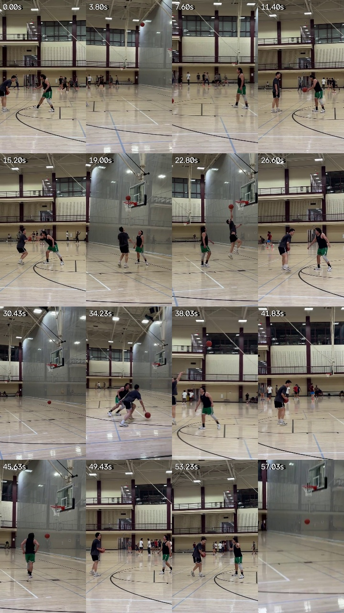
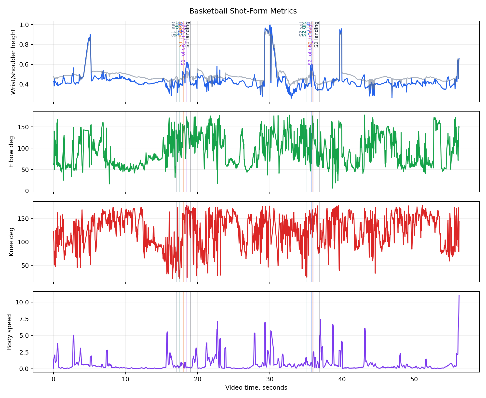
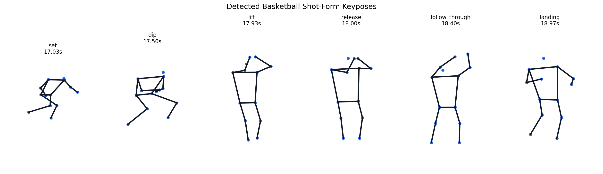

# Yifan Basketball 07.10

This session is the first contested-gameplay example: a 57-second 1v1 clip ("vs Dreamway", indoor court), also published as a [YouTube Short](https://www.youtube.com/shorts/9nPEMg---YA).
Unlike solo-practice clips, this footage has two athletes, occlusion, and stretches where the primary athlete leaves the frame — which is exactly what made it a useful stress test.

## Open Example Files

| File | Use |
| --- | --- |
| `examples/yifan-basketball-0710/basketball.mp4` | Source basketball court clip |
| `examples/yifan-basketball-0710/basketball_overlay.mp4` | Skeleton overlay review video |
| `examples/yifan-basketball-0710/pose_sequence.json` | MediaPipe pose landmarks for tracked frames |
| `examples/yifan-basketball-0710/metrics.csv` | Per-frame basketball motion metrics |
| `examples/yifan-basketball-0710/summary.json` | Demo summary for reports |

## Video and Detection

- Duration: 57.07s
- Resolution: 480x854
- FPS: 30.00
- Pose coverage: 1621 of 1712 frames (94.7%)
- Mean landmark visibility: 0.860
- Reliable shot-form events isolated: 2

## Main Read

- This session drove two robustness upgrades that now apply to every basketball video:
  a **primary-athlete tracker** (`swingform_ai.tracking`) that detects up to two poses per frame and follows the one continuing the main track, and a **plausibility gate** in event detection that rejects release candidates from collapsed or phantom poses.
- The impact was concrete: single-pose tracking produced 4 claimed releases of which only 1 was real; with the tracker plus gate, the pipeline reports exactly the 2 real shots — including one at 18.00s that single-pose tracking had missed entirely because it was following the defender.
- Summary metrics are now computed only from plausible frames inside detected shot windows, so whole-clip transition noise no longer contaminates them.
- The release label is pose-based: it comes from visible wrist height, wrist speed, and arm extension, not from ball contact.
- The next technical step is rim association for make/miss context, plus appearance-based re-identification so the track survives long occlusions.

## Basketball Metrics

Computed over plausible frames within detected shot windows.

| Metric | Value |
| --- | ---: |
| Mean shooting elbow angle | 115.5 deg |
| Max shooting wrist height proxy | 0.620 |
| Min shooting knee angle | 22.5 deg |
| Mean body speed proxy | 0.652 |

## Interpretation

The best product direction is a personal multi-sport movement record: compare Yifan against Yifan first, then use cleaner labels to train sport-specific phase models later.
Golf can keep its address/top/impact/finish loop, while basketball gets set/dip/lift/release/follow-through/landing labels as pose proxies first and ball-linked events later.

## Detected Shot Events

| Shot | Set | Dip | Lift | Release proxy | Follow-through | Landing |
| --- | ---: | ---: | ---: | ---: | ---: | ---: |
| 1 | 17.03s | 17.50s | 17.93s | 18.00s | 18.40s | 18.97s |
| 2 | 34.70s | 35.13s | 35.77s | 35.93s | 35.97s | 36.83s |
